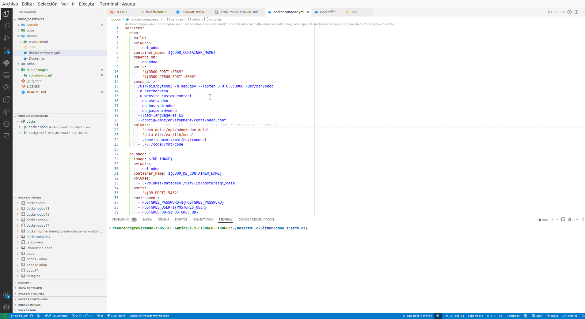
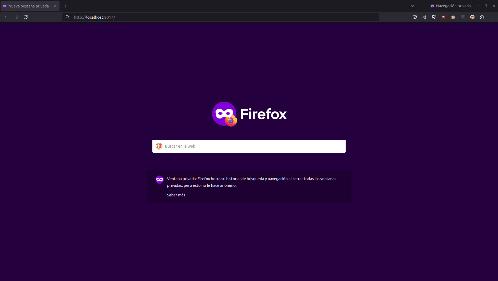

# Odoo scaffolds con docker y vscode

## Despliega rápidamente un entorno de desarrollo y depura paso a paso con toda la potencia de debugpy

Plantilla para poder desplegar un odoo en 10 minutos, utilizando docker, con el propósito de poder hacer debug de toda la ejecución.
Cada desarrollo en su versión o como más te plazca.

## Prerrequisitos

- Instalar docker-compose en el sistema operativo.
- Añadir al usuario al grupo "docker" si no deja inicializar docker-compose y se queja de los permisos.

## Pasos a seguir

1. Descargar el ZIP y descomprimirlo
2. Abrir el fichero __./docker/Dockerfile__ seleccionar la versión que se quiere utilizar (solo el dígito)

`FROM odoo:[versión]`

### Ejemplo para odoo 17

`FROM odoo:17`

3. Configurar el fichero __./docker/.env__  y configurar los siguientes valores si se quiere.

```
ODOO_CONTAINER_NAME=[Nombre del contenedor con la instancia de Odoo]
ODOO_DB_CONTAINER_NAME=[Nombre del contenedor de la base de datos]
ODOO_PORT=[Puerto de odoo]
ODOO_DEBUG_PORT=[Puerto para debugpy]
DB_IMAGE=postgres:[versión de posgresql]
DB_PORT=[puerto externop para la base de datos]
``` 
### Ejemplo para odoo 17
```
ODOO_CONTAINER_NAME=dock-core-odoo17
ODOO_DB_CONTAINER_NAME=dock-db-odoo17
ODOO_PORT=8017
ODOO_DEBUG_PORT=3017
DB_IMAGE=postgres:15
DB_PORT=5417
``` 

4. Iniciar el docker desde vscode



5. Accede a la instancia de Odoo desde la url `localhost:[ODOO_PORT]`

### Ejemplo para odoo 17

http://localhost:8017

User: admin
Password: admin




## Preguntas frecuentes

__Al arrancar de nuevo el docker-compose me está dando problemas con los permisos en la carpeta pgdata__

Hay que dar permisos completos a la carpeta volumes del docker.

Como el contenedor se ha creado con el usuario root puede dar problemas de permisos de acceso. 

__Ejemplo en Ubuntu__

- Navegar hasta el directorio volumes y ejecutar `$sudo chmod 777 -R .` 

# Carpeta con el código fuente de Odoo

Este directorio ha de contener el código de [https://github.com/odoo/odoo/tree/17.0](https://github.com/odoo/odoo/tree/17.0)


Este código se mapea en el fichero `.vscode/launch.json` para poder depurar el código del core con debugpy, paso a paso.