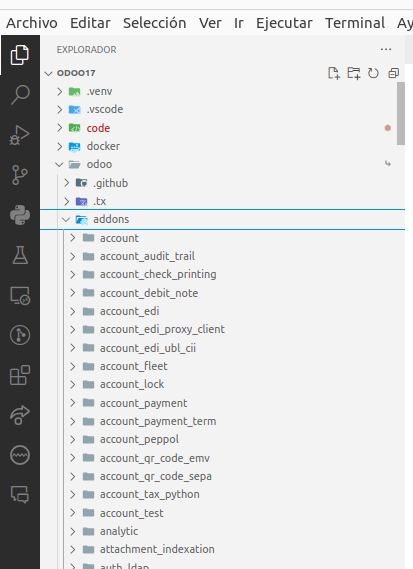

# Carpeta con el código fuente de Odoo

Este directorio ha de contener el código de [https://github.com/odoo/odoo/tree/17.0](https://github.com/odoo/odoo/tree/17.0)

Este código se mapea en el fichero `.vscode/launch.json` para poder depurar el código del core con debugpy, paso a paso.